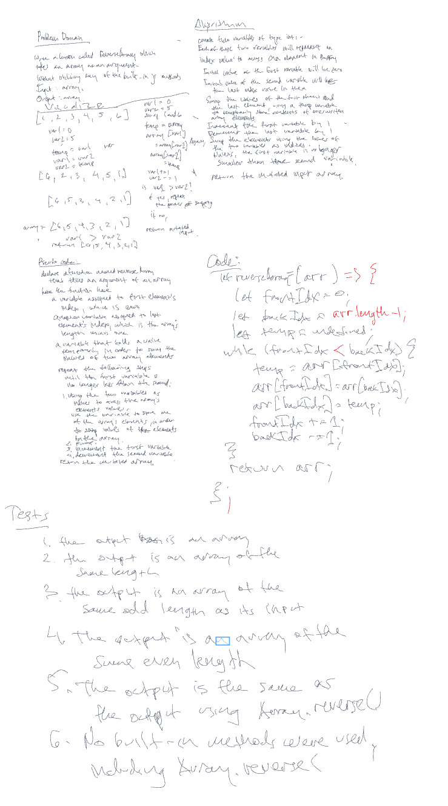

# Reverse an Array
<!-- Description of the challenge -->
## Feature Tasks
Write a function called `reverseArray` which takes an array as an argument. Without utilizing any of the built-in methods available to your language, return an array with elements in reversed order.

### Specifications

- Read all of the following instructions carefully.
- Name things exactly as described.
- Do all your work in a public repository called `data-structures-and-algorithms`.
- Create a new branch in your repo called `array-reverse`.
- Make a directory for this challenge, named according to your language’s conventions, containing a README.md file.
- Update the “Table of Contents” - in the README at the root of the repository - with a link to this challenge’s README file.
NOTE: This challenge is whiteboard only
Write out code as part of your whiteboard process, but don’t worry about creating external program files.
Your final whiteboard should look like this example layout.

## Whiteboard Process
<!-- Embedded whiteboard image -->

## Approach & Efficiency
<!-- What approach did you take? Discuss Why. What is the Big O space/time for this approach? -->
I followed the instructions given at https://codefellows.github.io/common_curriculum/data_structures_and_algorithms/Whiteboard_Workflow.html as my approach.  The big O is O(n/2) for small n and O(n) for larger n.