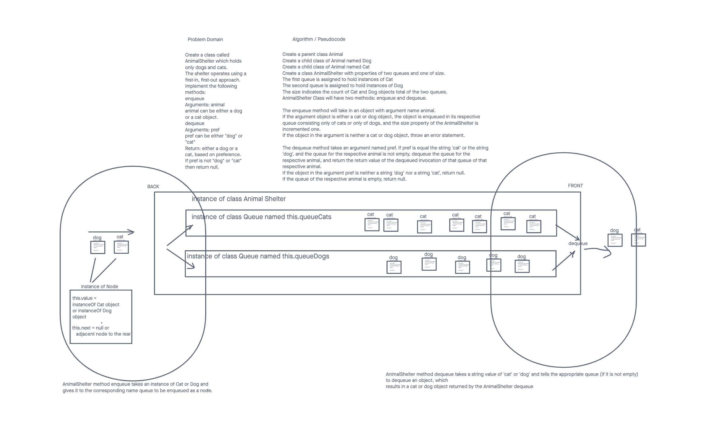

# Stack-queue-animal-shelter
<!-- Short summary or background information -->

## Challenge
<!-- Description of the challenge -->
Code Challenge: Class 12

First-in, First out Animal Shelter.

## Features

- Create a class called AnimalShelter which holds only dogs and cats.
- The shelter operates using a first-in, first-out approach.
- Implement the following methods:
  - enqueue
    - Arguments: animal
      - `animal` can be either a dog or a cat object.
  - dequeue
  - Arguments: pref
    - `pref` can be either "`dog`" or "`cat`"
  - Return: either a dog or a cat, based on preference.
    - If `pref` is not "`dog`" or "`cat`" then return null.

## Stretch Goal

If a cat or dog isn’t preferred, return whichever animal has been waiting in the shelter the longest.

## Requirements

Ensure your complete solution follows the standard requirements.

  1. Write [unit tests](https://codefellows.github.io/common_curriculum/data_structures_and_algorithms/Challenge_Testing)
  2. Follow the [template for a well-formatted README](https://codefellows.github.io/common_curriculum/data_structures_and_algorithms/Challenge_Documentation)
  3. Submit the assignment following [these instructions](https://codefellows.github.io/common_curriculum/data_structures_and_algorithms/Challenge_Submission)

## Daily whiteboard challenge rubric

| Daily whiteboard challenge rubric | |  | 
| :--------------------------------------------------------- | :-: | -----------: |
| Criteria | Ratings	| Pts |
| Whiteboard Exercise | | |
| Possible deduction: // 2 pts: Did not follow whiteboard workflow // 2 pts: Did not DO the exercise // 1 pt: ~50% incomplete exercise // 1 pt: Any step of workflow does not follow the correct structure/syntax |    | 2 pts |
| Code Implementation | | |
| Possible deductions: // 0.5 pt: Inefficient solution // 0.5 pt: Missing comments/doc-strings // 1 pt: ~50% incomplete // 1 pt : Missing test requirements |  | 2 pts |
| README
Follows the standards provided in the specification for each challenge. Those standards typically include a Title, Challenge details, and a Solution image showing the whiteboard exercise. Point allocation is ALL OR NOTHING. |  | 1 pts |
| | |                                                             Total Points: 5   |

## Structure and Testing

Utilize the Single-responsibility principle: any methods you write should be clean, reusable, abstract component parts to the whole challenge. You will be given feedback and marked down if you attempt to define a large, complex algorithm in one function definition.

## Whiteboard Process
<!-- Embedded whiteboard image -->

## Approach & Efficiency
<!-- What approach did you take? Why? What is the Big O space/time for this approach? -->

## Solution
<!-- Show how to run your code, and examples of it in action -->
