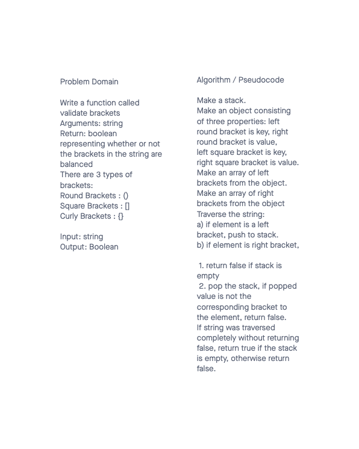

# Stack-queue-brackets
<!-- Short summary or background information -->
Multi-bracket Validation.

## Challenge
<!-- Description of the challenge -->
Code Challenge: Class 13

Stack-queue-brackets

## Feature Tasks

- Write a function called validate brackets
- Arguments: string
- Return: boolean
- representing whether or not the brackets in the string are balanced


### There are 3 types of brackets:

Round Brackets : ()
Square Brackets : []
Curly Brackets : {}

#### Example

| Input	| Output |
| :---- | -----: |
|{}	| TRUE |
|{}(){}	| TRUE |
|()[[Extra Characters]]	| TRUE |
|(){}[[]]	| TRUE
|{}{Code}[Fellows](())	| TRUE |
|[({}]	| FALSE |
|(](	| FALSE |
|{(})	| FALSE |

#### Consider these small examples and why they fail.

| Input	| Output	| Why |
| :---- | ------ | ---:|
| {	| FALSE	| error unmatched opening { remaining. |
| )	| FALSE	| error closing ) arrived without corresponding opening. |
| [} | FALSE	| error closing }. Doesn’t match opening (. |


## Requirements

Ensure your complete solution follows the standard requirements.

  1. Write [unit tests](https://codefellows.github.io/common_curriculum/data_structures_and_algorithms/Challenge_Testing)
  2. Follow the [template for a well-formatted README](https://codefellows.github.io/common_curriculum/data_structures_and_algorithms/Challenge_Documentation)
  3. Submit the assignment following [these instructions](https://codefellows.github.io/common_curriculum/data_structures_and_algorithms/Challenge_Submission)

## Daily whiteboard challenge rubric

| Daily whiteboard challenge rubric | |  | 
| :--------------------------------------------------------- | :-: | -----------: |
| Criteria | Ratings	| Pts |
| Whiteboard Exercise | | |
| Possible deduction: // 2 pts: Did not follow whiteboard workflow // 2 pts: Did not DO the exercise // 1 pt: ~50% incomplete exercise // 1 pt: Any step of workflow does not follow the correct structure/syntax |    | 2 pts |
| Code Implementation | | |
| Possible deductions: // 0.5 pt: Inefficient solution // 0.5 pt: Missing comments/doc-strings // 1 pt: ~50% incomplete // 1 pt : Missing test requirements |  | 2 pts |
| README
Follows the standards provided in the specification for each challenge. Those standards typically include a Title, Challenge details, and a Solution image showing the whiteboard exercise. Point allocation is ALL OR NOTHING. |  | 1 pts |
| | |                                                             Total Points: 5   |

## Structure and Testing

Utilize the Single-responsibility principle: any methods you write should be clean, reusable, abstract component parts to the whole challenge. You will be given feedback and marked down if you attempt to define a large, complex algorithm in one function definition.

## Whiteboard Process
<!-- Embedded whiteboard image -->


## Approach & Efficiency
<!-- What approach did you take? Why? What is the Big O space/time for this approach? -->
I followed the directions from the readings and lecture as my approach to build out the methods. O(n) space and time due to for loop traversal of string.

## Solution
<!-- Show how to run your code, and examples of it in action -->
```` node
% npm test stack-queue-bracket                       

> data-structures-and-algorithms@1.0.0 test
> jest --verbose --coverage "stack-queue-bracket"

 PASS  __tests__/stack-queue-brackets.test.js
  testing the Stack Class
    ✓ Can successfully instantiate an empty stack (1 ms)
    ✓ Can properly push onto a stack
    ✓ Can successfully push multiple values onto a stack (1 ms)
    ✓ Can successfully pop off the stack
    ✓ Can successfully empty a stack after multiple pops (1 ms)
    ✓ Can successfully peek the next item on the stack
    ✓ Calling pop or peek on empty stack raises exception (35 ms)
  testing the validBrackets function
    ✓ Can successfully return the correct value (1 ms)

  console.log
    you cannot pop if stack is empty

      at Stack.peek (index.js:38:15)

  console.log
    you cannot pop if stack is empty

      at Stack.pop (index.js:27:15)

----------|---------|----------|---------|---------|-------------------
File      | % Stmts | % Branch | % Funcs | % Lines | Uncovered Line #s 
----------|---------|----------|---------|---------|-------------------
All files |     100 |      100 |     100 |     100 |                   
 index.js |     100 |      100 |     100 |     100 |                   
----------|---------|----------|---------|---------|-------------------
Test Suites: 1 passed, 1 total
Tests:       8 passed, 8 total
Snapshots:   0 total
Time:        1.065 s
Ran all test suites matching /stack-queue-bracket/i.
````