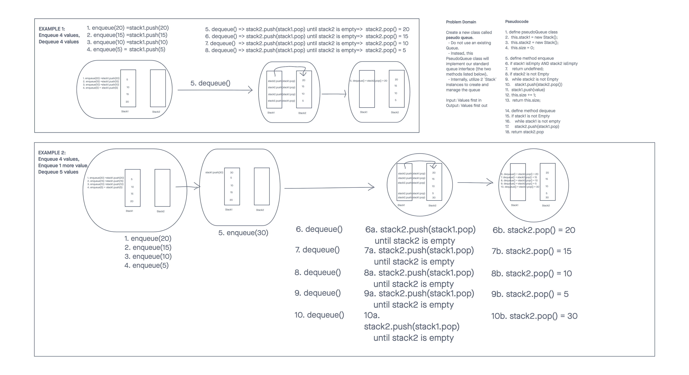

# Challenge Summary 

- Implement a Queue using two Stacks.
<!-- Description of the challenge -->
- Code Challenge: Class 11

## Challenge Setup & Execution
Branch Name: `stack-queue-pseudo`

Challenge Type: Code Challenge / Algorithm

## Feature Tasks

- Create a new class called pseudo queue.
  - Do not use an existing Queue.
  - Instead, this PseudoQueue class will implement our standard queue interface (the two methods listed below),
  - Internally, utilize 2 `Stack` instances to create and manage the queue

- Methods:
  - enqueue
    - Arguments: value
    - Inserts value into the PseudoQueue, using a first-in, first-out approach.
  - dequeue
    - Arguments: none
    - Extracts a value from the PseudoQueue, using a first-in, first-out approach.h

`NOTE`: The Stack instances have only `push`, `pop`, and `peek` methods. You should use your own Stack implementation. Instantiate these Stack objects in your PseudoQueue constructor.

Example
`enqueue(value)`
| Input	            | Args | Output                 |
| ----------------- | :--: | ---------------------- |
| [10]->[15]->[20]	| 5	   | [5]->[10]->[15]->[20]  |
|                   | 5	   | [5]                    |

`dequeue()`
| Input	                | Output | Internal State   |
| --------------------- | :----: | ---------------- |
| [5]->[10]->[15]->[20]	| 20     | [5]->[10]->[15]  |
| [5]->[10]->[15]	      | 15	   | [5]->[10]        |

### Stack methods

1. Push - Nodes or items that are put into the stack are pushed
2. Pop - Nodes or items that are removed from the stack are popped. When you attempt to pop an empty stack an exception will be raised.
3. Top - This is the top of the stack.
4. Peek - When you peek you will view the value of the top Node in the stack. When you attempt to peek an empty stack an exception will be raised.
5. IsEmpty - returns true when stack is empty otherwise returns false.

### Queue methods

1. Enqueue - Nodes or items that are added to the queue.
2. Dequeue - Nodes or items that are removed from the queue. If called when the queue is empty an exception will be raised.
3. Front - This is the front/first Node of the queue.
5. Back - This is the back/rear/last Node of the queue.
6. Peek - When you peek you will view the value of the front Node in the queue. If called when the queue is empty an exception will be raised.
7. IsEmpty - returns true when queue is empty otherwise returns false.

## Requirements

Ensure your complete solution follows the standard requirements.

  1. Write [unit tests](https://codefellows.github.io/common_curriculum/data_structures_and_algorithms/Challenge_Testing)
  2. Follow the [template for a well-formatted README](https://codefellows.github.io/common_curriculum/data_structures_and_algorithms/Challenge_Documentation)
  3. Submit the assignment following [these instructions](https://codefellows.github.io/common_curriculum/data_structures_and_algorithms/Challenge_Submission)

## Daily whiteboard challenge rubric

| Daily whiteboard challenge rubric | |  | 
| :--------------------------------------------------------- | :-: | -----------: |
| Criteria | Ratings	| Pts |
| Whiteboard Exercise | | |
| Possible deduction: // 2 pts: Did not follow whiteboard workflow // 2 pts: Did not DO the exercise // 1 pt: ~50% incomplete exercise // 1 pt: Any step of workflow does not follow the correct structure/syntax |    | 2 pts |
| Code Implementation | | |
| Possible deductions: // 0.5 pt: Inefficient solution // 0.5 pt: Missing comments/doc-strings // 1 pt: ~50% incomplete // 1 pt : Missing test requirements |  | 2 pts |
| README
Follows the standards provided in the specification for each challenge. Those standards typically include a Title, Challenge details, and a Solution image showing the whiteboard exercise. Point allocation is ALL OR NOTHING. |  | 1 pts |
| | |                                                             Total Points: 5   |


## Structure and Testing

Utilize the Single-responsibility principle: any methods you write should be clean, reusable, abstract component parts to the whole challenge. You will be given feedback and marked down if you attempt to define a large, complex algorithm in one function definition.

Write tests to prove the following functionality:

1. Can successfully enqueue into a pseudoqueue
2. Can successfully enqueue multiple values into a pseudoqueue
3. Can successfully dequeue out of a pseudoqueue the expected value
4. Can successfully empty a pseudoqueue after multiple dequeues
5. Can successfully instantiate an empty pseudoqueue
6. Calling dequeue on empty pseudoqueue raises exception

Ensure your tests are passing before you submit your solution.

## Whiteboard Process
<!-- Embedded whiteboard image -->


## Approach & Efficiency
<!-- What approach did you take? Why? What is the Big O space/time for this approach? -->
I followed the directions from the readings and lecture as my approach to build out the methods. O(n) space and time.

## Solution
<!-- Show how to run your code, and examples of it in action -->

````
npm test stack-pseudoqueue.test.js

> data-structures-and-algorithms@1.0.0 test
> jest --verbose --coverage "stack-pseudoqueue.test.js"

 PASS  __tests__/stack-pseudoqueue.test.js
  testing the Stack Class
    ✓ Can successfully instantiate an empty stack (1 ms)
    ✓ Can properly push onto a stack (1 ms)
    ✓ Can successfully push multiple values onto a stack
    ✓ Can successfully pop off the stack (1 ms)
    ✓ Can successfully empty a stack after multiple pops (1 ms)
    ✓ Can successfully peek the next item on the stack
    ✓ Calling pop or peek on empty stack raises exception (43 ms)
  testing the PseudoQueue Class
    ✓ Can successfully enqueue into a pseudoqueue
    ✓ Can successfully enqueue multiple values into a pseudoqueue (1 ms)
    ✓ Can successfully dequeue out of a pseudoqueue the expected value
    ✓ Can successfully empty a pseudoqueue after multiple dequeues
    ✓ Can successfully instantiate an empty pseudoqueue
    ✓ Calling dequeue on empty pseudoqueue raises exception

  console.log
    you cannot pop if stack is empty

      at Stack.peek (index.js:38:15)

  console.log
    you cannot pop if stack is empty

      at Stack.pop (index.js:27:15)

----------|---------|----------|---------|---------|-------------------
File      | % Stmts | % Branch | % Funcs | % Lines | Uncovered Line #s 
----------|---------|----------|---------|---------|-------------------
All files |     100 |      100 |     100 |     100 |                   
 index.js |     100 |      100 |     100 |     100 |                   
----------|---------|----------|---------|---------|-------------------
Test Suites: 1 passed, 1 total
Tests:       13 passed, 13 total
Snapshots:   0 total
Time:        1.054 s, estimated 2 s
Ran all test suites matching /stack-pseudoqueue.test.js/i.
````
